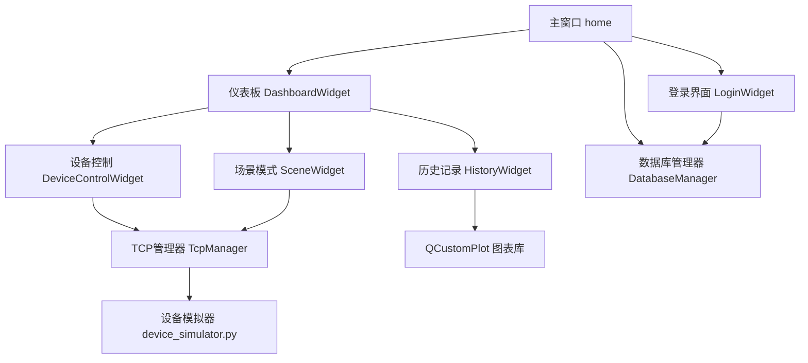

# 智能家居监控平台技术文档

## 1. 项目概述

本项目是一个基于 Qt 框架开发的智能家居监控平台，旨在提供一个直观、易用的界面，用于监控和控制智能家居设备。系统通过 TCP 协议与设备模拟器进行通信，实现对灯光、空调等设备的远程控制，并实时采集和展示环境数据。

### 1.1 主要功能111

- **用户登录**：提供用户身份验证功能
- **设备控制**：支持对灯光、空调等设备的控制
- **场景模式**：预设多种场景模式，如回家模式、离家模式、睡眠模式
- **历史记录**：实时采集温度和湿度数据，绘制图表并支持数据导出
- **异常报警**：预留异常报警功能接口
- **系统设置**：预留系统设置功能接口

### 1.2 技术栈

- **前端框架**：Qt 6.10.2
- **后端**：C++
- **数据库**：SQLite
- **网络通信**：TCP/IP
- **设备模拟**：Python
- **图表绘制**：QCustomPlot

## 2. 项目结构

```
homeProject/
├── .qtcreator/               # Qt Creator 配置文件
├── build/                    # 构建输出目录
├── dashboardwidget.cpp       # 仪表板界面实现
├── dashboardwidget.h         # 仪表板界面头文件
├── databasemanager.cpp       # 数据库管理实现
├── databasemanager.h         # 数据库管理头文件
├── device_simulator.py       # 设备模拟器（Python）
├── devicecontrolwidget.cpp   # 设备控制界面实现
├── devicecontrolwidget.h     # 设备控制界面头文件
├── historywidget.cpp         # 历史记录界面实现
├── historywidget.h           # 历史记录界面头文件
├── home.cpp                  # 主窗口实现
├── home.h                    # 主窗口头文件
├── home.ui                   # 主窗口 UI 文件
├── homeProject.pro           # 项目配置文件
├── loginwidget.cpp           # 登录界面实现
├── loginwidget.h             # 登录界面头文件
├── main.cpp                  # 程序入口
├── qcustomplot.cpp           # QCustomPlot 库实现
├── qcustomplot.h             # QCustomPlot 库头文件
├── scenewidget.cpp           # 场景模式界面实现
├── scenewidget.h             # 场景模式界面头文件
├── tcpmanager.cpp            # TCP 通信管理实现
└── tcpmanager.h              # TCP 通信管理头文件
```

## 3. 系统架构

### 3.1 整体架构

系统采用分层架构，主要分为以下几层：

1. **界面层**：负责用户交互和数据展示，包括登录界面、仪表板、设备控制、场景模式和历史记录等模块
2. **通信层**：负责与设备模拟器的通信，通过 TCP 协议发送控制命令和接收设备状态
3. **数据层**：负责数据的存储和管理，使用 SQLite 数据库存储用户信息、设备信息和操作日志
4. **模拟层**：使用 Python 实现的设备模拟器，模拟智能家居设备的行为

### 3.2 核心模块关系



## 4. 核心功能模块

### 4.1 主窗口（home）

主窗口是整个应用的容器，负责管理登录界面和仪表板界面的切换。

**主要功能**：
- 初始化数据库连接
- 创建并管理 QStackedWidget，用于界面切换
- 连接登录成功信号，实现从登录界面到仪表板的切换

**关键代码**：
```cpp
// 初始化 UI
void home::initUI() {
    // 使用布局管理器
    if (!layout()) {
        QVBoxLayout *layout = new QVBoxLayout(this);
        layout->setContentsMargins(0, 0, 0, 0);
        setLayout(layout);
    }
    
    m_mainStack = new QStackedWidget(this);
    
    m_loginWidget = new LoginWidget(this);
    m_dashboardWidget = new DashboardWidget(this);
    
    m_mainStack->addWidget(m_loginWidget);      // Index 0
    m_mainStack->addWidget(m_dashboardWidget);  // Index 1
    
    // 添加到主布局
    layout()->addWidget(m_mainStack);
    
    // 连接登录信号
    connect(m_loginWidget, &LoginWidget::loginSuccessful, [this](){
        m_mainStack->setCurrentWidget(m_dashboardWidget);
    });
    
    // 初始显示登录界面
    m_mainStack->setCurrentWidget(m_loginWidget);
}
```

### 4.2 登录界面（LoginWidget）

登录界面提供用户身份验证功能。

**主要功能**：
- 显示登录表单，包括用户名和密码输入框
- 处理登录按钮点击事件
- 发送登录成功信号

**关键代码**：
```cpp
void LoginWidget::onLoginClicked() {
    QString username = m_usernameEdit->text();
    QString password = m_passwordEdit->text();
    
    if (username.isEmpty()) {
        QMessageBox::warning(this, "提示", "用户名不能为空");
        return;
    }
    
    // TODO: 与 DatabaseManager 验证
    // 目前简单发送信号
    emit loginSuccessful();
}
```

### 4.3 仪表板（DashboardWidget）

仪表板是用户登录后看到的主界面，包含多个功能模块。

**主要功能**：
- 左侧导航菜单，用于切换不同功能模块
- 右侧内容区域，显示当前选中模块的内容
- 监听 TCP 数据，更新历史记录

**关键代码**：
```cpp
void DashboardWidget::setupContentArea() {
    m_contentStack = new QStackedWidget(this);
    
    // 0. 首页总览（占位符）
    QLabel *homeLabel = new QLabel("欢迎使用智能家居监控平台\n请点击左侧菜单选择功能", this);
    homeLabel->setAlignment(Qt::AlignCenter);
    QFont f = homeLabel->font(); f.setPointSize(16); homeLabel->setFont(f);
    m_contentStack->addWidget(homeLabel);
    
    // 1. 设备控制
    m_contentStack->addWidget(new DeviceControlWidget(this));
    
    // 2. 场景模式
    m_contentStack->addWidget(new SceneWidget(this));
    
    // 3. 历史数据
    m_contentStack->addWidget(new HistoryWidget(this));
    
    // 4. 异常报警（占位符）
    QLabel *alarmLabel = new QLabel("异常报警模块开发中...", this);
    alarmLabel->setAlignment(Qt::AlignCenter);
    m_contentStack->addWidget(alarmLabel);
    
    // 5. 系统设置（占位符）
    QLabel *settingsLabel = new QLabel("系统设置模块开发中...", this);
    settingsLabel->setAlignment(Qt::AlignCenter);
    m_contentStack->addWidget(settingsLabel);
    
    // 连接列表选择与堆栈切换
    connect(m_menuList, &QListWidget::currentRowChanged, m_contentStack, &QStackedWidget::setCurrentIndex);
}
```

### 4.4 设备控制（DeviceControlWidget）

设备控制模块用于管理和控制智能家居设备。

**主要功能**：
- 显示设备列表，包括设备名称、类型和状态
- 提供设备控制按钮，如开关灯光、调节空调
- 支持连接到设备模拟器

**关键代码**：
```cpp
// 设备项控件的控制按钮点击处理
if (type == "LIGHT")
{
    m_iconLabel->setText("💡");
    m_controlBtn->setText(status == "ON" ? "关闭" : "开启");
    connect(m_controlBtn, &QPushButton::clicked, [this]()
            {
        QString cmd = (m_statusLabel->text() == "ON") ? "OFF" : "ON";
        // 使用 ID 构建命令：LIGHT_LIVING_ON
        emit controlClicked(QString("%1_%2").arg(m_id.toUpper()).arg(cmd)); });
}
```

### 4.5 场景模式（SceneWidget）

场景模式模块允许用户一键激活预设的场景。

**主要功能**：
- 显示预设场景列表，如回家模式、离家模式、睡眠模式
- 双击场景项激活场景，发送一系列控制命令

**关键代码**：
```cpp
void SceneWidget::onActivateScene(QListWidgetItem *item) {
    QString sceneName = item->text();
    QStringList commands = item->data(Qt::UserRole).toStringList();
    
    if (QMessageBox::question(this, "激活场景", "确认激活 " + sceneName + " ?") == QMessageBox::Yes) {
        for(const QString &cmd : commands) {
            TcpManager::instance().sendCommand(cmd);
        }
        QMessageBox::information(this, "成功", sceneName + " 已激活");
    }
}
```

### 4.6 历史记录（HistoryWidget）

历史记录模块用于显示和分析环境数据。

**主要功能**：
- 使用 QCustomPlot 绘制温度和湿度的实时图表
- 显示数据表格，记录详细的环境数据
- 支持数据导出为 CSV 文件

**关键代码**：
```cpp
void HistoryWidget::addDataPoint(double temp, double humidity) {
    double now = QDateTime::currentDateTime().toSecsSinceEpoch();
    
    // 添加到图表
    m_plot->graph(0)->addData(now, temp);
    m_plot->graph(1)->addData(now, humidity);
    
    // 自动调整坐标轴
    m_plot->xAxis->setRange(now, 60, Qt::AlignRight); // 显示最后 60 秒（滚动）
    m_plot->replot();
    
    // 添加到表格
    int row = m_table->rowCount();
    m_table->insertRow(row);
    m_table->setItem(row, 0, new QTableWidgetItem(QDateTime::currentDateTime().toString("yyyy-MM-dd HH:mm:ss")));
    m_table->setItem(row, 1, new QTableWidgetItem(QString::number(temp, 'f', 1)));
    m_table->setItem(row, 2, new QTableWidgetItem(QString::number(humidity, 'f', 1)));
    
    // 自动滚动表格
    m_table->scrollToBottom();
}
```

### 4.7 TCP 管理器（TcpManager）

TCP 管理器负责与设备模拟器的通信。

**主要功能**：
- 建立和管理 TCP 连接
- 发送控制命令到设备模拟器
- 接收设备状态和传感器数据

**关键代码**：
```cpp
void TcpManager::sendCommand(const QString &cmd) {
    if (!m_isConnected) {
        qDebug() << "Cannot send command: Not connected";
        emit errorOccurred("设备未连接");
        return;
    }
    
    QByteArray data = cmd.toUtf8();
    m_socket->write(data);
    m_socket->flush();
    qDebug() << "Sent command:" << cmd;
}

void TcpManager::onReadyRead() {
    QByteArray data = m_socket->readAll();
    QString strData = QString::fromUtf8(data);
    qDebug() << "Received data:" << strData;
    emit dataReceived(strData);
}
```

### 4.8 数据库管理器（DatabaseManager）

数据库管理器负责数据的存储和管理。

**主要功能**：
- 初始化 SQLite 数据库连接
- 创建必要的数据表（用户表、设备表、日志表）
- 提供数据库操作接口

**关键代码**：
```cpp
bool DatabaseManager::initTables() {
    QSqlQuery query;
    // 创建用户表
    bool success = query.exec("CREATE TABLE IF NOT EXISTS users ("
                              "id INTEGER PRIMARY KEY AUTOINCREMENT, "
                              "username TEXT UNIQUE NOT NULL, "
                              "password TEXT NOT NULL)");
    if (!success) {
        qDebug() << "Failed to create users table:" << query.lastError().text();
        return false;
    }
    
    // 创建设备表
    success = query.exec("CREATE TABLE IF NOT EXISTS devices ("
                         "id INTEGER PRIMARY KEY AUTOINCREMENT, "
                         "name TEXT NOT NULL, "
                         "type TEXT NOT NULL, "
                         "status INTEGER DEFAULT 0, "
                         "params TEXT)"); // params 可存储 JSON 或格式化字符串
     if (!success) {
        qDebug() << "Failed to create devices table:" << query.lastError().text();
        return false;
    }
    
    // 创建日志表
    success = query.exec("CREATE TABLE IF NOT EXISTS logs ("
                         "id INTEGER PRIMARY KEY AUTOINCREMENT, "
                         "timestamp DATETIME DEFAULT CURRENT_TIMESTAMP, "
                         "user TEXT, "
                         "device_name TEXT, "
                         "action TEXT, "
                         "result TEXT)");
    if (!success) {
         qDebug() << "Failed to create logs table:" << query.lastError().text();
         return false;
    }

    return true;
}
```

### 4.9 设备模拟器（device_simulator.py）

设备模拟器使用 Python 实现，模拟智能家居设备的行为。

**主要功能**：
- 监听 TCP 连接
- 处理来自客户端的控制命令
- 定期发送传感器数据（温度、湿度）

**关键代码**：
```python
def process_command(self, cmd):
    # 格式: DEVICE_ACTION_PARAM (例如, LIGHT_LIVING_ON)
    parts = cmd.split('_')
    if len(parts) < 2:
        return "ERROR_INVALID_CMD"

    # 示例逻辑
    if cmd == "LIGHT_LIVING_ON":
        self.devices["light_living"] = "ON"
        return "LIGHT_LIVING_ON_OK"
    elif cmd == "LIGHT_LIVING_OFF":
        self.devices["light_living"] = "OFF"
        return "LIGHT_LIVING_OFF_OK"
    # 其他命令处理...

def send_sensor_data(self, client_socket):
    while True:
        time.sleep(2)  # 每 2 秒发送一次
        
        # 模拟温度和湿度变化
        self.devices["temp_sensor"] += random.uniform(-0.5, 0.5)
        self.devices["humid_sensor"] += random.uniform(-1.0, 1.0)
        
        # 确保值在合理范围内
        self.devices["temp_sensor"] = max(18.0, min(30.0, self.devices["temp_sensor"]))
        self.devices["humid_sensor"] = max(30.0, min(80.0, self.devices["humid_sensor"]))
        
        # 发送传感器数据
        data = f"ENV_DATA:TEMP={self.devices['temp_sensor']:.1f},HUMID={self.devices['humid_sensor']:.1f}"
        try:
            client_socket.send(data.encode('utf-8'))
        except:
            break
```

## 5. 技术实现细节

### 5.1 界面设计

- 使用 Qt 的布局管理器（QVBoxLayout、QHBoxLayout、QGridLayout）实现灵活的界面布局
- 使用 QStackedWidget 实现不同功能模块之间的切换
- 使用 QListWidget 作为左侧导航菜单
- 使用 QCustomPlot 库绘制实时数据图表

### 5.2 网络通信

- 使用 Qt 的 QTcpSocket 类实现 TCP 客户端功能
- 采用单例模式设计 TcpManager，确保全局只有一个 TCP 连接
- 实现了连接状态管理、错误处理和数据收发功能

### 5.3 数据处理

- 使用 SQLite 数据库存储用户信息、设备信息和操作日志
- 使用 QCustomPlot 库处理和展示实时数据
- 支持将历史数据导出为 CSV 文件

### 5.4 设备模拟

- 使用 Python 的 socket 库实现 TCP 服务器
- 模拟多种智能家居设备的行为和状态
- 定期生成并发送模拟的传感器数据

## 6. 关键技术点

### 6.1 单例模式的应用

在 TcpManager 和 DatabaseManager 中使用了单例模式，确保全局只有一个实例，便于在不同模块中共享和访问。

**实现方式**：
```cpp
static TcpManager& instance() {
    static TcpManager instance;
    return instance;
}
```

### 6.2 信号与槽机制

Qt 的信号与槽机制用于组件之间的通信，如登录成功信号、设备控制信号等。

**示例**：
```cpp
// 连接登录信号
connect(m_loginWidget, &LoginWidget::loginSuccessful, [this](){
    m_mainStack->setCurrentWidget(m_dashboardWidget);
});
```

### 6.3 实时数据图表

使用 QCustomPlot 库实现温度和湿度的实时图表展示，支持自动滚动和数据更新。

**关键实现**：
- 添加两个图表系列，分别用于温度和湿度
- 使用时间作为 X 轴，自动调整显示范围
- 定期添加数据点并重新绘制图表

### 6.4 设备控制命令格式

采用统一的命令格式，如 "LIGHT_LIVING_ON"、"AC_LIVING_TEMP_26" 等，便于设备模拟器解析和处理。

## 7. 系统运行流程

1. **启动程序**：运行 main.cpp 中的 main 函数，创建主窗口
2. **初始化**：主窗口初始化数据库连接，创建登录界面和仪表板界面
3. **登录**：用户在登录界面输入用户名和密码，点击登录按钮
4. **进入仪表板**：登录成功后，切换到仪表板界面
5. **设备控制**：在设备控制模块中，用户可以查看设备状态并发送控制命令
6. **场景激活**：在场景模式模块中，用户可以双击激活预设场景
7. **查看历史数据**：在历史记录模块中，用户可以查看温度和湿度的实时图表和详细数据
8. **数据通信**：TCP 管理器负责与设备模拟器通信，发送控制命令并接收设备状态和传感器数据

## 8. 配置与部署

### 8.1 环境要求

- Qt 6.10.2 或更高版本
- MinGW 64-bit 编译器
- Python 3.7 或更高版本（用于运行设备模拟器）

### 8.2 运行步骤

1. **启动设备模拟器**：
   ```bash
   python device_simulator.py
   ```

2. **编译并运行 Qt 应用**：
   - 使用 Qt Creator 打开 homeProject.pro 文件
   - 编译并运行项目

3. **连接设备**：
   - 在设备控制界面中，输入设备模拟器的 IP 地址（默认 127.0.0.1）和端口（默认 12345）
   - 点击连接按钮

4. **控制设备**：
   - 点击设备列表中的控制按钮，发送控制命令
   - 查看设备状态更新

5. **查看历史数据**：
   - 切换到历史记录界面，查看实时温度和湿度图表

## 9. 问题与解决方案

### 9.1 登录功能未与数据库集成

**问题**：登录界面目前只是简单发送登录成功信号，未与数据库进行验证。

**解决方案**：
- 在 LoginWidget::onLoginClicked() 方法中，使用 DatabaseManager 验证用户名和密码
- 实现用户注册功能，将新用户信息存储到数据库

### 9.2 历史数据未持久化

**问题**：历史记录数据仅保存在内存中，程序关闭后数据丢失。

**解决方案**：
- 在 HistoryWidget::addDataPoint() 方法中，将数据存储到数据库
- 程序启动时，从数据库加载历史数据

### 9.3 异常报警和系统设置模块未实现

**问题**：异常报警和系统设置模块目前只是占位符。

**解决方案**：
- 实现异常报警功能，当温度或湿度超过阈值时触发报警
- 实现系统设置功能，允许用户配置设备参数、报警阈值等

### 9.4 设备控制界面的 AC 控制部分代码未完全实现

**问题**：DeviceControlWidget 中的 AC 控制部分代码未完全显示。

**解决方案**：
- 完成 AC 控制界面的实现，包括温度调节、模式选择和风速控制
- 确保 AC 控制命令正确发送到设备模拟器

## 10. 总结与展望

本项目实现了一个基本的智能家居监控平台，具有以下特点：

- **功能完整**：包含登录、设备控制、场景模式、历史记录等核心功能
- **界面友好**：使用 Qt 框架构建直观、美观的用户界面
- **通信可靠**：使用 TCP 协议实现与设备模拟器的可靠通信
- **数据可视化**：使用 QCustomPlot 实现实时数据图表展示

未来可以进一步改进和扩展：

- **完善登录系统**：与数据库集成，实现用户注册和密码验证
- **增加设备类型**：支持更多类型的智能家居设备
- **实现远程控制**：通过互联网实现远程设备控制
- **添加语音控制**：集成语音识别功能，支持语音控制设备
- **增强数据分析**：添加数据分析和预测功能，提供更智能的家居管理建议

通过不断改进和扩展，该平台可以成为一个功能强大、用户友好的智能家居管理系统。